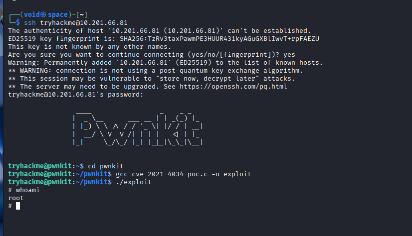

# _**Contextualização**_
Também conhecida como <mark>PwnKit</mark>, é uma vulnerabilidade de Elevação de Privilégios Local (LPE), localizada no pacote **Polkit**  
**Polkit** está instalado por padrão em quase todas as principais distribuições do sistema operacional Linux  
Isso afeta virtualmente todo sistema Linux _mainstream_ no planeta  

## _**Sobre PolKit**_
O Polkit faz parte do _sistema de autorização do Linux_  
Na prática, quando você tenta executar uma ação que requer um nível mais alto de privilégios, o Polkit pode ser usado para determinar se você possui as permissões necessárias  

Ele é integrado ao **systemd** e é muito mais configurável do que o sistema tradicional **sudo**  
De fato, às vezes é chamado de o **sudo do systemd**, pois oferece um sistema granular para atribuir permissões aos usuários  
Ao interagir com o Polkit, podemos usar a utilidade **pkexec**, e é este programa que contém a vulnerabilidade Pwnkit  

## _**Sobre a Vulnerabilidade**_
Foi descoberta por **pesquisadores da Qualys** e anunciada em janeiro de 2022  
Mais sobre essa vulnerabilidade pode ser [encontrado aqui](https://www.qualys.com/2022/01/25/cve-2021-4034/pwnkit.txt)  

A vulnerabilidade existe em todas as versões do pacote **Policy Toolkit (ou Polkit)** desde seu primeiro lançamento, em 2009, e permite que qualquer atacante não privilegiado obtenha facilmente acesso administrativo total a qualquer máquina Linux com o pacote Polkit instalado  

<mark>O Polkit vem instalado por padrão na maioria das distribuições Linux, tornando essa vulnerabilidade extremamente disseminada</mark>  

A facilidade de exploração e a natureza ubíqua do Polkit tornam-na uma vulnerabilidade absolutamente devastadora  
No entanto, felizmente não é explorável remotamente, fazendo do Pwnkit uma vulnerabilidade puramente de elevação de privilégios local (LPE)  

<mark>Versões do pkexec lançadas antes da correção não tratam os argumentos de linha de comando de forma segura, o que leva a uma vulnerabilidade de escrita fora dos limites (out-of-bounds write), permitindo que um atacante manipule o ambiente com o qual o pkexec é executado</mark>  

Mais especificamente, o pkexec tenta analisar quaisquer argumentos de linha de comando que lhe passemos usando um laço for, começando em um índice 1 para contornar o nome do programa e obter o primeiro argumento real  

Por exemplo, se digitarmos ```pkexec bash```, então como **pkexec é o nome do programa**, ele seria o argumento 0  
Os argumentos reais da linha de comando começam no índice 1  
O nome do programa é irrelevante para a análise de argumentos, então o índice é simplesmente deslocado para ignorá-lo  
**O que acontece, então, se não fornecermos argumentos? O índice fica permanentemente definido como 1!**  

Se o número de argumentos for 0 então _n_ nunca é menor que o número de argumentos  
Isso vira um problema depois, quando o **pkexec** tenta escrever no valor do argumento no índice _n_  
Como não há argumentos de linha de comando, não existe argumento no índice _n_  

<mark>Em vez disso o programa sobrescreve a próxima coisa na memória, que por acaso é o primeiro valor na lista de variáveis de ambiente quando o programa é chamado usando a função C execve()</mark>  
Em outras palavras, ao passar ao pkexec uma lista nula de argumentos, podemos forçá-lo a sobrescrever uma variável de ambiente!  

Certas variáveis de ambiente perigosas são removidas pelo sistema operacional quando você tenta executar um programa que tem o bit SUID definido  
Isso evita que atacantes sequestrem o programa enquanto ele é executado com permissões administrativas  

<mark>Usando a escrita fora dos limites (out-of-bounds), conseguimos reintroduzir a variável de ambiente perigosa que quisermos enganando o pkexec para que ela seja adicionada para nós</mark>  
Existem várias formas de abusar disso, todas levando à execução de código como o **usuário root**  

## _**Exploração**_
Há muitos exploits disponíveis online, e escrever sua própria versão não é particularmente difícil  
Para o repositório oficial, acesse [este link](https://github.com/arthepsy/CVE-2021-4034)  

Vamos acessar a máquina pela plataforma **TryHackMe** e executar o necessário para obter _root_  



## _**Prevenção e remediações**_
Como podemos nos proteger?  

Felizmente, os desenvolvedores costumam ser bastante rápidos ao desenvolver correções para vulnerabilidades críticas  
Como exemplo principal: no momento da redação, a **Canonical já lançou** versões corrigidas do pacote Polkit no gerenciador de pacotes APT para todas as versões do Ubuntu que não estão em fim de vida  

A versão corrigida pode ser instalada com um simples _apt upgrade_  
Em distribuições que ainda não liberaram versões corrigidas do pacote, a correção temporária recomendada é simplesmente <mark>remover o bit SUID do binário pkexec</mark>  
Isso pode ser feito com um comando como o seguinte: ```sudo chmod 0755 $(pkexec)```  

Deve-se notar que existem muitas variações do exploit Pwnkit usando diferentes variáveis de ambiente e explorando a vulnerabilidade de maneiras distintas  
Algumas dessas variações deixam vestígios e logs, outras não  

Você pode verificar se um sistema está corrigido tentando executar uma cópia do exploit contra ele  
Se o exploit retornar o menu de ajuda do pkexec, então o sistema está corrigido
