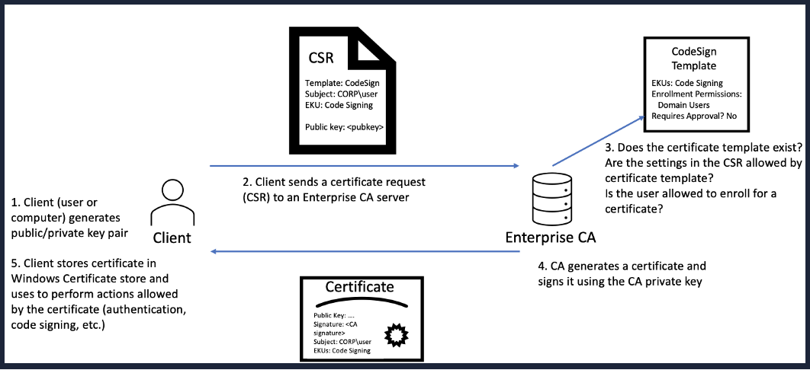
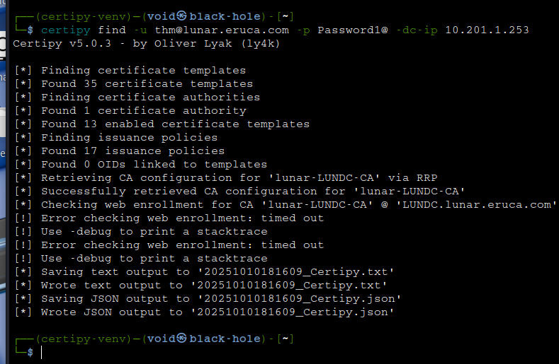

# _**Sobre a Vulnerabilidade**_
Esta é uma vulnerabilidade no _Serviço de Certificação do Active Directory_ da Microsoft que permite **qualquer** usuário de um AD escalar privilégios para _Domain Admin_ em um único _hop_  
Segundo **[SpecterOps](https://posts.specterops.io/certified-pre-owned-d95910965cd2)**, é possível explorar _templates_ de certificados mal configurados para a escalação de privilégios e movimento lateral  
Através de alguns _clicks_, foi constatado que, qualquer conta com baixos privilégios pode escalar e ter acesso a uma conta com altos privilégios  

## _**Sobre Active Directory**_
AD provê além de gerenciamento de acesso e identidade, diversos outros serviços que ajudam neste gerenciamento da organização.  
Um destes serviços é o _AD CS_: **Active Directory Certificate Services**.  
O _AD CS_ é a implementação da **Infraestrutura de Chave Pública (PKI)**.  
Como _AD_ provê um nível de segurança, ele pode ser utilizado como um _**Certificate Authority (CA)**_ para transferir e garantir segurança.  
_**AD CS**_ é utilizado para criptografia de arquivos de sistema, criação e verificação de assinaturas digitais e até autenticação de usuário.  
A figura abaixo mostra o ciclo de geração e requisição de certificados.  



Como _**AD CS**_ é uma função privilegiada, ela é executada por alguns _**domain controllers**_, o que significa que usuários normais não podem interagir com este serviço.  
Em organizações muito grandes, é difícil a distribuição manual de diversos certificados, para isso, existem as _**certificate templates**_.  
Administradores de _**AD CS**_ podem criar alguns _templates_ que permitem qualquer usuário realizar requisição de um certificado.  
Estes _templates_ contém parâmetros que ditam quais usuários podem realizar essa requisição e o que é necessário para tal.  
**SpectreOps** encontrou que, como determiandos parâmetros podem ser abusados e tornar possível realizar a escalação de privilégios.  

## _**Explicando a Vulnerabilidade**_
Autenticação de um cliente permite o dono do certificado usá-lo para verificar a própria identidade em _AD_ para propósitos de autenticação  
O processo de autenticação ocorre através do _**Kerberos**_.  
Se tivermos um certificado válido que contém o _**EKU**_ de autenticação do cliente, podemos interagir com o _**AD CS**_ e o centro de distribuição da chave para solicitar ao _**Kerberos TGT**_ que pode ser usado para autenticações futuras.  
Como um atacante, podemos utilizar-se disto para gerar um _**Ticket Granting Ticker (TGT)**_ para se passar por outro usuário no sistema.

## _**Template padrão do Certificado**_
Por padrão, quando um _**D CS**_ é instalado em um ambiente, duas _templates_ ficam disponíveis para requisição que suportam autenticação de cliente.  
* **User Certificate Template**: Pode ser requisitada por qualquer usuário
* **Machine Certificate Template**: Pode ser requisitada por qualquer _host_ que pertenca ao grupo **Domain Computers**

A _**User Template**_ não é vulnerável por padrão.  
Quando ela é requisitada, o UPN da conta de usuário será integrada ao SAN que pode ser usada para identificação.  
Já que UPNs devem ser únicos, e geralmente não tem como realizar modificações na própria UPN, não tem como se aproveitar dela.  
Porém, _**Computer Accounts**_ não possuem UPN.  
Ao invés de usar um UPN para autenticação, eles utilizam-se do nome de DNS da máquina para identificação e autenticação.  
<mark>Quando um certificado é requisitado por uma máquina através da _template_ da máquina, _**AD CS**_ integra o nome de DNS da máquina no _**Subject alternative Name (SAN)**_, que consequentemente pode ser usado para autenticação</mark>.  

## _**Domain User Privileges**_
Por padrão, qualquer usuário que é membro do _**Autenticated Users Group**_ (todas as contas AD), podem adicionar até 10 novas máquinas no domínio.  
Isso geralmente é feito em organizações que tem a política BYOD.  
Quando adicionamos um novo _host_ a um **AD**, somos designados como _donos_ daquele _host_.  
Garantinddo certas permissões sobre o objeto associado AD à aquele _host_.  
Duas permissões causam problemas. São elas:
* _**Validate Write to DNS hostname**_: Essa permissão permite atualizar o _hostname_ DNS de nosso objeto associado AD do _host_
* _**Validate write to Service Principal Name (SPN)**_: Essa permissão permite atualizar o SPN de nosso objeto associado AD do _host_

_**SPNs**_ são utilizados pela autenticação _Kerberos_ para associar uma instância de serviço com um _logon_ de uma conta de serviço.  
Por padrão, o AD _**Computer Object**_ recebe associação aos SPNs que contém seus nomes para permitir a autenticação _Kerberos_.  
O SPN deve ser único, o que quer dizer que dois objetos AD não são permitidos terem o mesm o SPN.  
Se você atualizar o _hostname_ DNS, a Microsoft automaticamente atualiza os atributos SPNs.  
Como estes atributos devem ser únicos, uma mensagem de erro irá aparecer.  
Mas como temos a abilidade de alterar o SPN, podemos realizar um _bypass_ dessa restrição.  

## _**Explicação final**_
Utilizando estas configurações, o _template_ de certificado _**AD CS**_ padrão da máquina, a abilidade padrão de adicionar uma nova máquina e as permissões padrão designadas no objeto AD da máquina, temos um vetor para escalar privilégios.  

Passo-a-passo:
1. Comprometer as credenciais de um usuário com poucos privilégios
2. Utilizar estas credenciais para agregar um novo _host_ ao domínio
3. Alterar o atributo _hostname_ DNS do objeto AD da máquina para um _host_ privilegiado, como o _**Domain Controller**_
4. Remover o SPN atribuído para realizar um _bypass_ do conflito de SPN único
5. Realizar uma requisição de _Machine Certificate_ utilizando o _template_ padrão
6. Realizar uma autenticação _Kerberos_ com a _template_ recebida, agora, como a conta da máquina que tem os privilégios ao invés da nossa

# _**PoC**_
Primeiro, vamos configurar o DNS  
Abra o arquivo de configuração _/etc/hosts_ e adicione
> ```bash
> [ip_address] lundc.lunar.eruca.com lundc lunar-LUNDC-CA lunar.eruca.com
> ```

Para realizar os testes, é necessário realizar o _download_ da ferramenta **Certipy**.  
O manual para instalação se encontra [neste link](https://github.com/ly4k/Certipy/wiki/04-%E2%80%90-Installation).  
Após, vamos utilizar o comando abaixo para testar a geração de um certificado 
> ```bash
> certipy find -u thm@lunar.eruca.com -p Password1@ -dc-ip [ip_address]
> ```


Vamos então, utilizar o comando abaixo para gerar um certificado para o nosso usuário de baixo privilégio
> ```bash
> certipy req 'lunar.eruca.com/thm:Password1@@lundc.lunar.eruca.com' -ca LUNAR-LUNDC-CA -template User
> ```
Após algumas tentantivas, não foi possível obter o certificado através do comando fornecido pelo exemplo.  
Estudando e pesquisando um pouco mais sobre a ferramenta, foram obtidos novos e diferentes erros como _timeout_ e _rpc access denied_  
Com mais um tempo de pesquisa e tentativas, com o comando abaixo foi possível gerar o certificado que estavamos esperando  
> ```bash
> certipy-ad req -u 'thm@lunar.eruca.com' -CA 'LUNAR-LUNDC-CA' -template 'HTTPWebServer' -upn 'administrator@lunar.eruca.com' -dc-ip [ip_address]
> ```
![]

