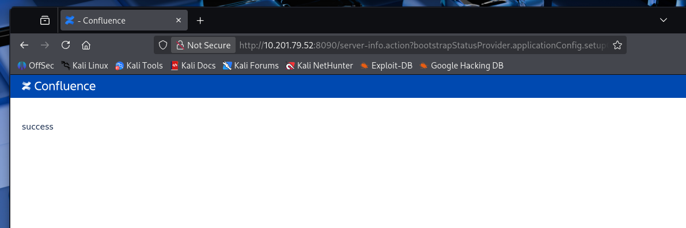
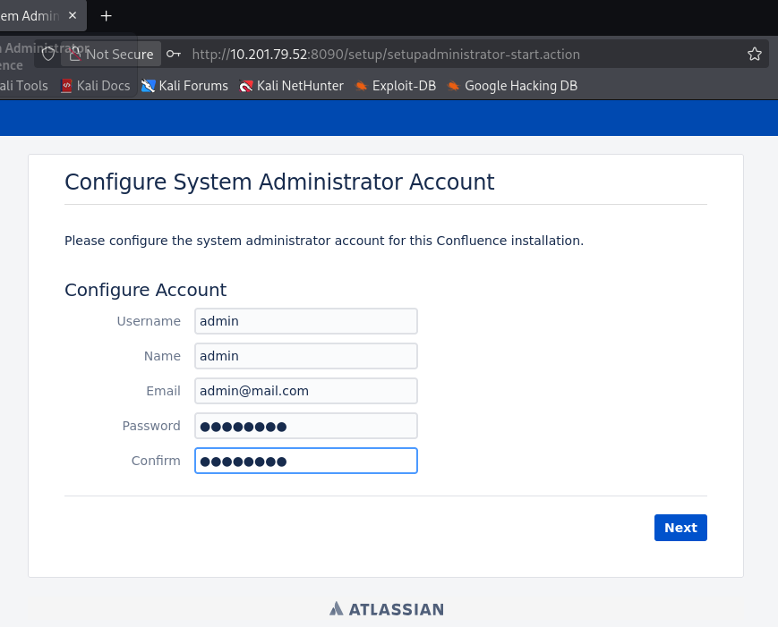

# _**Sobre a vulnerabilidade**_
A **Atlassian** divulgou um aviso de segurança sobre a CVE-2023-22515, uma vulnerabilidade de quebra de controle de acesso, com pontuação CVSS atribuída de 10.0  
A falha foi introduzida na versão 8.0.0 do **Confluence Server e Confluence Data Center** e está presente nas versões anteriores a 8.3.3, anteriores a 8.4.3 e anteriores a 8.5.2  
De acordo com a Atlassian, a vulnerabilidade já foi explorada ativamente em ambientes reais  

Um atacante pode explorar a vulnerabilidade para criar uma conta adicional no Confluence com privilégios administrativos completos  
O atacante não precisa de nenhuma informação prévia para explorar a vulnerabilidade  

Acredita-se que a vulnerabilidade possibilite outros vetores de ataque desconhecidos e deve ser corrigida o mais rápido possível  
Mais sobre a vulnerabilidade pode ser encontrado [aqui](https://confluence.atlassian.com/security/cve-2023-22515-privilege-escalation-vulnerability-in-confluence-data-center-and-server-1295682276.html)  

## _**PoC**_
Ao executar o Confluence pela primeira vez, você passa pelo processo de configuração inicial, que permite definir alguns parâmetros básicos e criar uma conta administrativa  

Se você tentar acessar novamente essa configuração após concluí-la, não conseguirá refazê-la  
Em vez disso, verá uma mensagem informando que o processo de instalação já foi concluído  
<mark>Essa vulnerabilidade permite que um invasor reative o processo de configuração inicial</mark>  
Assim, o atacante pode refazer a etapa de criação de um novo administrador, obtendo acesso total ao sistema  

Tudo isso é possível porque o _Confluence é construído sobre o framework Apache Struts_, que depende do pacote XWork  
O XWork permite definir Actions (ações) na forma de classes Java  
Cada _Action_ pode ser invocada por meio de uma URL, e a classe Java correspondente lida com a requisição, executa o que a ação determina e emite uma resposta  

Navegue até **http://[confluence]:[port]/**  
Você deve ser imediatamente redirecionado para **http://[confluence]:[port]/login.action**  
Essa URL chama uma Action vinculada a uma classe Java responsável por lidar com tentativas de login  
Quando uma Action é invocada por meio de sua URL, o método _execute()_ da classe é chamado por padrão  

Também é possível chamar _getters e setters_ nas classes de Action usando uma URL que especifique um parâmetro HTTP com a cadeia de atributos que desejamos obter ou definir  
Por exemplo, se a classe da Action de login tivesse um método setId(), poderíamos invocá-lo através da seguinte URL:```http://[confluence]:[port]/login.action?Id=123```  
Isso executaria o método setId('123'), conforme definido na classe Action correspondente  

O exploit reportado tira proveito da Action ServerInfoAction  
O motivo de escolher essa Action específica é que podemos construir uma <mark>cadeia de getters e setters</mark> a partir dela para definir o parâmetro de configuração que ativa ou desativa o processo de configuração inicial  

Ao analisar o código da classe **ServerInfoAction**, nota-se que ela estende a classe **ConfluenceActionSupport**  
Ao fazer isso, ela herda todos os métodos dessa classe  
Um desses métodos é um _getter_ que retorna um objeto do tipo **BootstrapStatusProvider**  

Nos importamos com a classe **BootstrapStatusProvider** porque ela possui outro _getter_ que nos permite obter um objeto **ApplicationConfiguration**  

Como você provavelmente já imaginou, esse objeto contém as configurações da aplicação, incluindo um atributo que indica se o Confluence já concluiu o processo de configuração inicial  
Esse atributo pode ser modificado usando um _setter_ na classe **ApplicationConfig**  

Se chamarmos setSetupComplete(false), estaremos, na prática, reativando o processo de configuração inicial  
Juntando tudo, podemos encadear esses getters e setters acessando a seguinte URL
> ```bash
> http://[confluence]:[port]/server-info.action?bootstrapStatusProvider.applicationConfig.setupComplete=false
> ```
Vá ao seu navegador e acesse a URL criada para acionar a vulnerabilidade  



Agora que podemos acessar o assistente de configuração inicial novamente, vamos navegar para  
> ```bash
> http://[confluence]:[port]/setup/setupadministrator-start.action
> ```


Se tudo correr bem, você deverá obter acesso ao Confluence com privilégios administrativos!  

## _**Exploit**_
Explorar a vulnerabilidade é relativamente simples e pode ser feito manualmente usando uma única requisição e um navegador comum  
Mesmo assim, exploits automatizados estão prontamente disponíveis  
Chocapikk desenvolveu um desses exploits, que pode ser baixado [aqui](https://github.com/Chocapikk/CVE-2023-22515)  

## _**Detecção e mitigação**_
Se você tiver uma instância de uma versão vulnerável do Confluence, certifique-se de verificar o seguinte:
* Logs de acesso de rede apontando para /setup/*.action. Não há motivo para um usuário comum solicitar tais URLs após a instalação 
* Logs de acesso de rede para /server-info.action?bootstrapStatusProvider.applicationConfig.setupComplete=false
* Revise os usuários do Confluence e procure por contas suspeitas e membros do grupo confluence-administrators

Todas as instâncias vulneráveis devem ser atualizadas para pelo menos uma das seguintes versões o quanto antes:
* 8.3.3
* 8.4.3
* 8.5.2

Se a atualização não for possível imediatamente, **o acesso aos endpoints /setup/ pode ser bloqueado como medida temporária**
