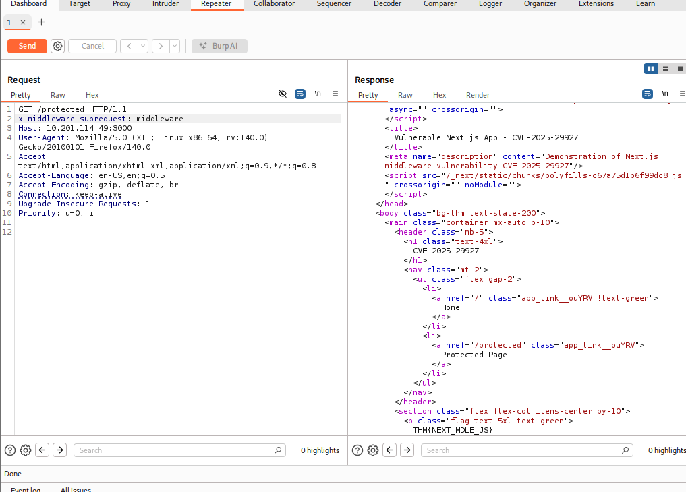

# _**Contextualização**_
<mark>A CVE-2025-29927</mark>, descoberta por **Rachid e Yasser Allam** no Next.js, revelou que é possível contornar verificações de autorização quando elas ocorrem no middleware  

O **middleware** é a parte que dá aos desenvolvedores controle sobre as requisições recebidas  
Ele atua como uma ponte entre a requisição de entrada e o sistema de roteamento  
Esse sistema de roteamento é baseado em arquivos, logo, as rotas são criadas e gerenciadas pela organização de arquivos e diretórios  

O Next.js é um framework de desenvolvimento web criado pela Vercel para simplificar a criação de aplicações web de alto desempenho  
Construído sobre o React, o Next.js amplia suas capacidades ao adicionar diversos recursos, como geração estática de sites (SSG) e renderização no lado do servidor (SSR)  

O SSG pré-gera páginas durante o processo de build, permitindo uma entrega mais rápida aos usuários  
Aém disso, o SSR renderiza as páginas no momento da requisição, reduzindo o tempo de carregamento  

Essa vulnerabilidade permite que invasores bypassem a autorização baseada em middleware, e todas as **versões anteriores às 14.2.25 e 15.2.3** são suscetíveis a ela  

## _**PoC com o comando curl**_
Um código para exploração de PoC e o código do exploit foram publicados por Yunus Aydin no [GitHub](https://github.com/aydinnyunus/CVE-2025-29927)  
Explorar a vulnerabilidade CVE-2025-29927 é bem simples  
Segundo a explicado na [publicação original](https://zhero-web-sec.github.io/research-and-things/nextjs-and-the-corrupt-middleware) que divulgou a vulnerabilidade, a adição do cabeçalho abaixo basta  
Tudo o que o atacante precisa fazer é adicionar o cabeçalho <mark>HTTP extra x-middleware-subrequest: middleware</mark> na requisição  
Esse cabeçalho faz com que a requisição seja encaminhada ao destino sem que o middleware a manipule  
> ```bash
> curl -H "x-middleware-subrequest: middleware" http://[ip_address]:[port]/protected
> ```
O comando é como um comando _curl_ comum com uma exceção: ele usa -H, equivalente a --header, para adicionar um cabeçalho extra à requisição **HTTP GET**  
Consequentemente, o comando _curl_ acima permite ao atacante contornar todos os controles de segurança e recuperar a página protegida  


## _**PoC com a ferramenta Burp Suite**_
Para conseguir explorar com o **Burp**, capute uma requisição para o endereço ```http://[ip_address]:[port]/protected```  
Em seguida, no _header HTTP_, adicione ```x-middleware-subrequest: middleware```  



## _**Detecção e Mitigação**_
Os logs do servidor web podem potencialmente ser usados para encontrar evidências de que esse exploit ocorreu  
No entanto, isso dependerá de o servidor web estar configurado para registrar cabeçalhos HTTP  
Por exemplo, o NodeJS permite o registro desse cabeçalho HTTP específico  
<mark>request.headers['x-middleware-subrequest']</mark>

Se a aplicação web estiver sendo proxada, a configuração de logs em servidores web como Nginx ou Apache2 precisará ser modificada para registrar esse cabeçalho específico  
<mark>LogFormat "%h %l %u %t \"%r\" %>s %b \"%{Referer}i\" \"%{User-Agent}i\" \"%{x-middleware-subrequest}i\"" custom</mark>

A regra Snort a seguir, quando usada como IDS, pode ser utilizada para detectar a exploração da CVE-2025-29927  
<mark>alert tcp any any -> any any (msg: "HTTP 'x-middleware-request' header detected, possible CVE-2025-29927 explotation"; content:"x-middleware-subrequest";  rawbytes; sid:10000001; rev:1)</mark>  

Para as versões corrigidas, os usuários devem atualizar para as seguintes versões:
* Next.js 15.x → atualizar para 15.2.3
* Next.js 14.x → atualizar para 14.2.25
* Next.js 13.x → atualizar para 13.5.9
* Next.js 12.x → atualizar para 12.3.5

Se a atualização não for viável, a única solução alternativa é bloquear requisições HTTP que contenham o cabeçalho x-middleware-subrequest antes que cheguem à aplicação web
